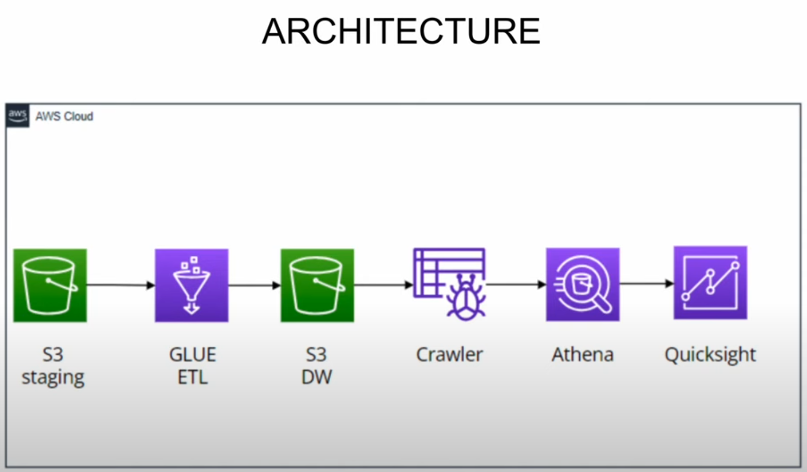
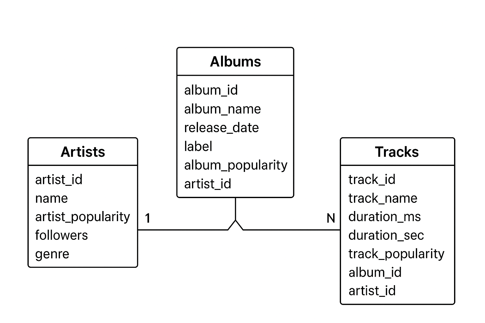

# spotify-data-engineering-end-to-end-project | AWS 
## Introduction
This project demonstrates a complete data engineering pipeline built on AWS to process and analyze Spotify music streaming data. The pipeline automates data ingestion, transformation, cataloging, and querying to derive meaningful insights about music trends, artist popularity, and user listening patterns.

## Architecture

## Technology used
1. AWS S3 for Staging
2. AWS Glue for ETL job transforms and cleans the data
3. AWS S3 for Datawarehouse
4. Glue Crawler to detect schema and create table
5. AWS Athena Serverless SQL query engine

## Data model

